# Figures

`python -m sjrwq.maps` writes the PNGs in `figures/` and this file together.
Every count below comes from `data/processed` at render time.

## Figure 1. San Joaquin study area

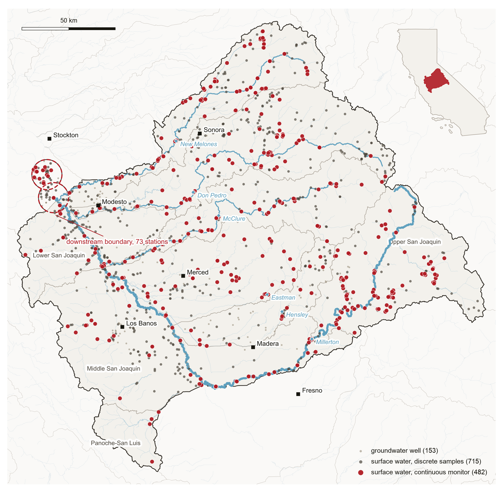

1,350 primary stations, each measuring at least one target parameter: 1,277
across 8 subbasins and 73 in the downstream boundary buffers, in HUC 18040003.
A station takes the first of the three classes it fits: a well draws as a well
whatever parameter the well records, so the 27 wells with a continuous record
sit in the groundwater class rather than the continuous one. Among the surface
stations the class is the finest record type across the station's parameters,
so a gage logging discharge every 15 minutes and sampling chloride by hand
draws as continuous. Marker size is fixed on this figure, one size per class.
Pale hydrography lies outside the study area.

## Figure 2. Water temperature monitoring

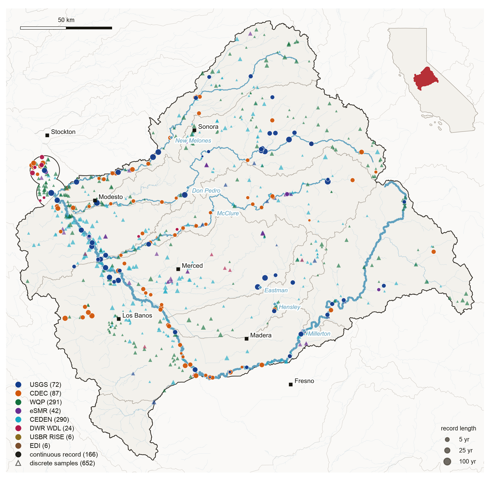

818 primary stations measure water temperature at some point in their record:
166 with a continuous monitor and 652 by discrete samples. Both the marker
shape and the marker area come from this parameter's own record rather than the
station's, so a gage that logs discharge and samples its conductance by hand
draws large and solid on the discharge map and small and pale on the
conductance map. Marker area scales with the square root of record length, and
the counts in the legend are stations rather than records.

## Figure 3. Specific conductance / EC monitoring

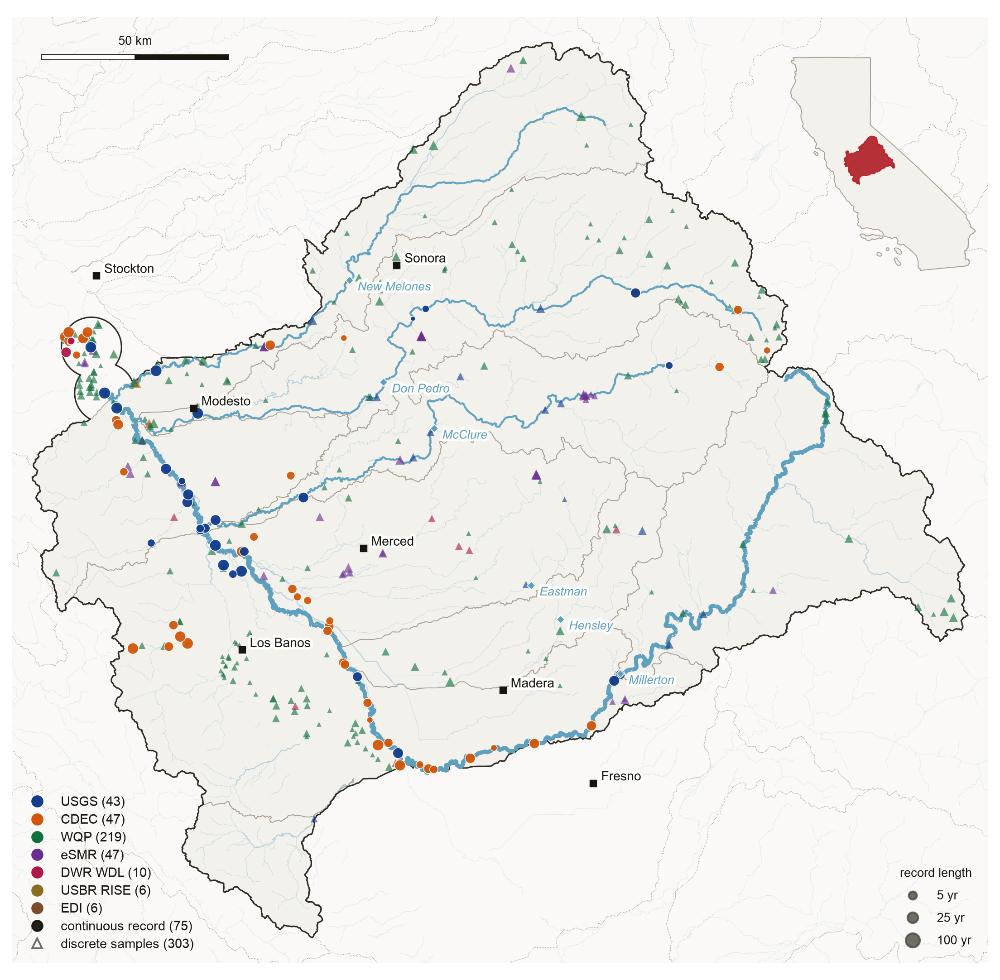

378 primary stations measure specific conductance at some point in their
record: 75 with a continuous monitor and 303 by discrete samples. Both the
marker shape and the marker area come from this parameter's own record rather
than the station's, so a gage that logs discharge and samples its conductance
by hand draws large and solid on the discharge map and small and pale on the
conductance map. Marker area scales with the square root of record length, and
the counts in the legend are stations rather than records.

## Figure 4. Streamflow monitoring

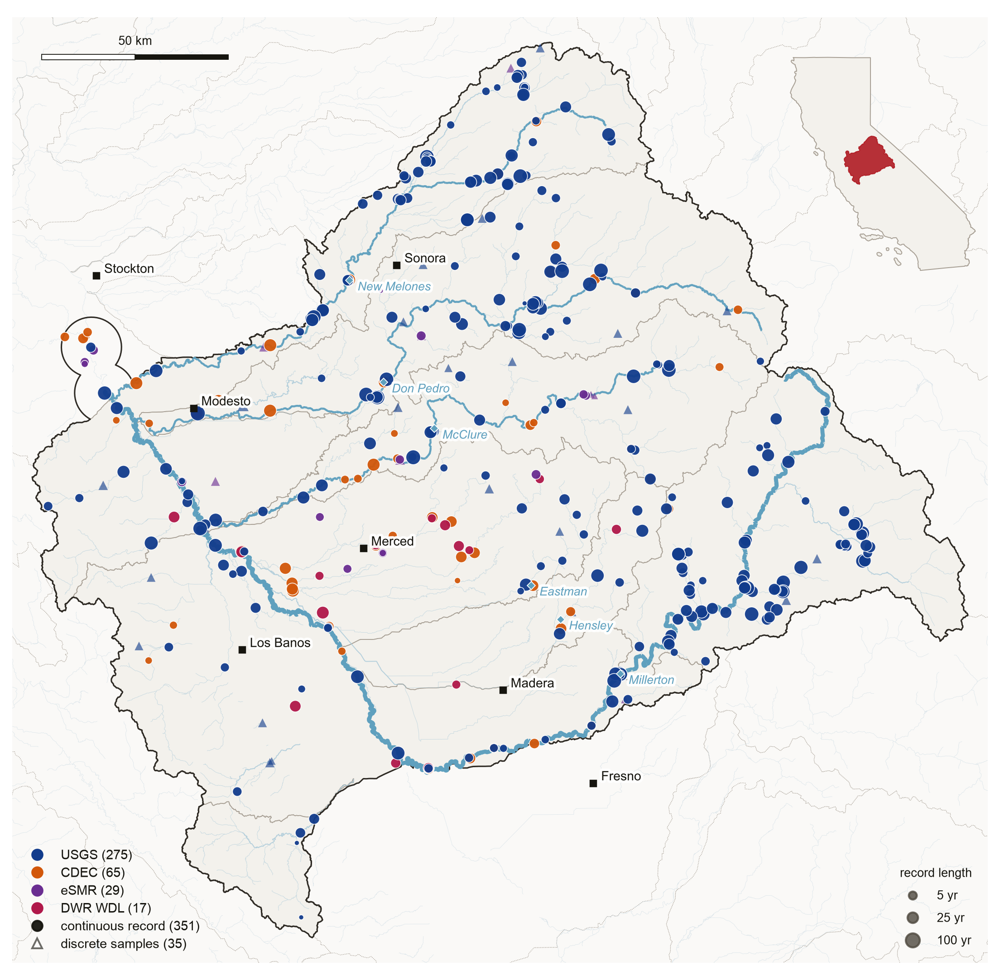

386 primary stations measure discharge at some point in their record: 351 with
a continuous monitor and 35 by discrete samples. Both the marker shape and the
marker area come from this parameter's own record rather than the station's, so
a gage that logs discharge and samples its conductance by hand draws large and
solid on the discharge map and small and pale on the conductance map. Marker
area scales with the square root of record length, and the counts in the legend
are stations rather than records.

## Figure 5. Where the basin is measured, and where it is not

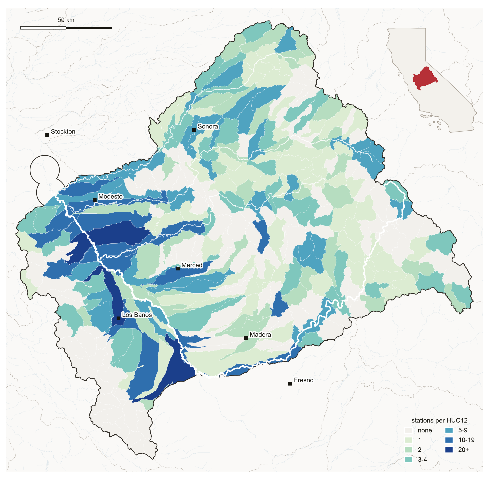

786 stations measuring water temperature or specific conductance, in 195 of 303
subwatersheds. The count is stations measuring either parameter, so a shaded
subwatershed has at least one temperature or conductance record at some
sampling frequency. The two unfilled circles at the downstream end are the 8 km
anchor buffers around Vernalis and Mossdale: the study area includes the
buffers and the HUC12 layer stops short of them. A further 72 stations sit
inside the buffers, in HUC 18040003.

## Figure 6. Period of record, one row per station

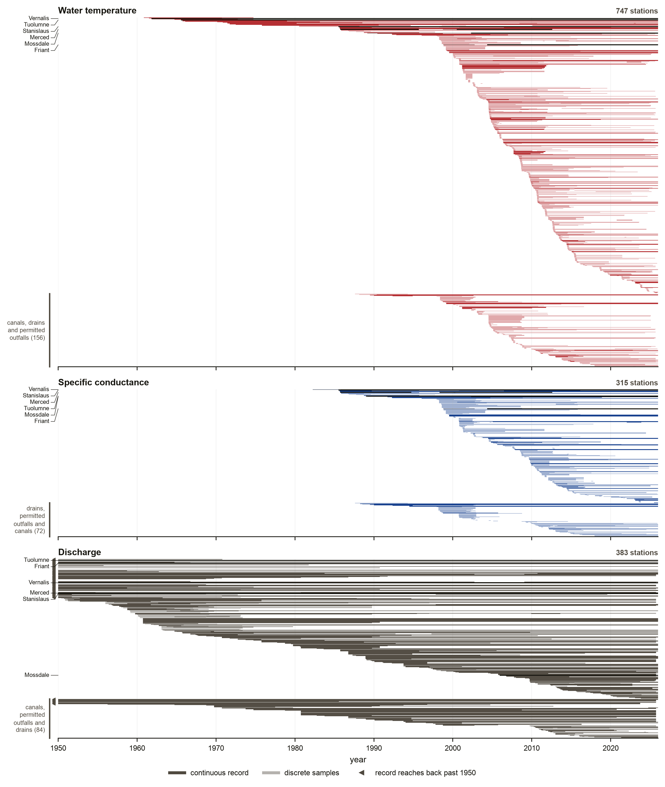

1,445 station records across three parameters, one row per station, sorted by
first year within a block. A break is a period longer than 180 days that no
source reports covering. Read the two kinds of gap differently: a gap in a WQP,
CEDEN or eSMR record comes from the samples themselves, while USGS and CDEC
publish a declared start and end, so an outage inside a USGS or CDEC period
stays invisible. Rows come from station-scope records, so the EDI package
periods that cover a station list rather than a named station stay out, and so
do the groundwater wells. A bar is solid across the years a continuous record
covers and pale across the years only discrete samples cover, so the number of
solid bars reaching into a year on a panel is the count figure 11 plots for
that year. Six gages have a name in the left margin and a black line, heavy
where the bar is solid and thin where the bar is pale: Vernalis and Mossdale
near the downstream boundary, Friant at the upstream one, and one gage each on
the Stanislaus, Tuolumne, and Merced.

## Figure 7. Mainstem coverage in space and time

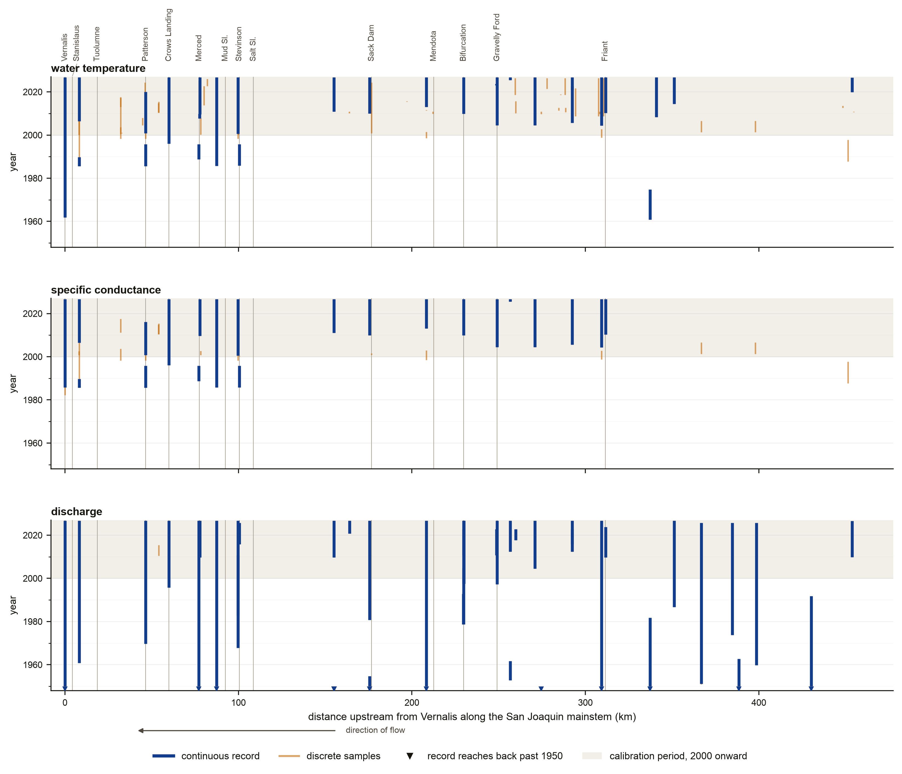

Each vertical line is one station, drawn over its period of record against its
distance upstream from Vernalis. A line is heavy and blue across the years a
continuous record covers and thin and orange across the years only discrete
samples cover, and a break is a period longer than 180 days that no source
reports covering. Stations on a natural channel or a permitted receiving water
only: of the 158 within 500 m of the centerline, 72 belong to other classes and
have no line here (28 groundwater, 16 reservoir, 16 conveyance, 5 drain, 5
unknown, 2 effluent). The three panels share one year axis, so a blank stretch
on one of them is an absence rather than a change of scale. A vertical band
with no lines is a reach of the mainstem with no record of that parameter in
those years.

## Figure 8. Co-located stations

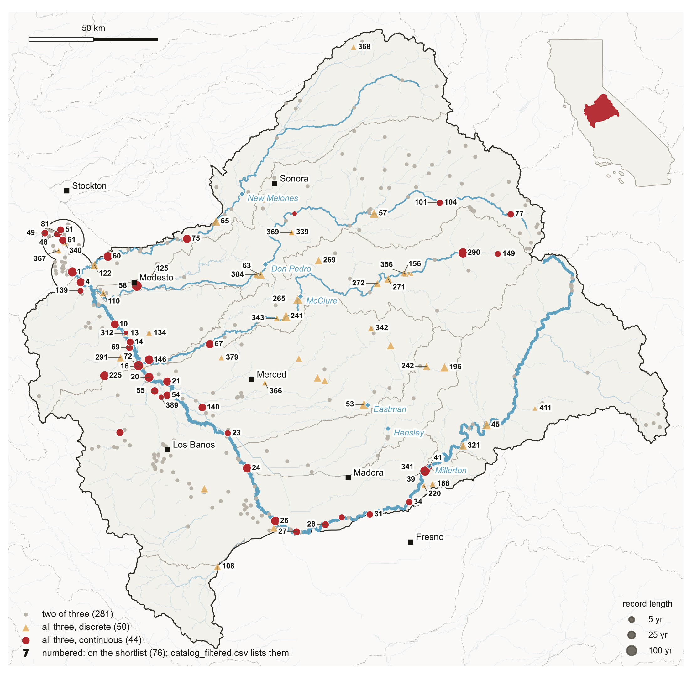

Water temperature, specific conductance, and discharge measured at one site: 94
stations, 44 of them measuring all three with a continuous monitor. 76 of the
94 are on the shortlist and are numbered here, and
`data/processed/catalog_filtered.csv` lists those 76 under the same number in
its `rank` column. The remaining 336 shortlist stations lack at least one of
the three: 20 of those 336 gage discharge and 316 don't. The 151 that measure
two of the three draw as unnumbered gray dots, and the other 185 measure one
and appear on figure 10 and not on this map. Numbering runs downstream to
upstream along the mainstem, then off-mainstem, then the canals, drains, wells,
and outfalls, so the sequence on the map isn't contiguous. A leader line marks
a label moved clear of a neighbor.

## Figure 9. From harvested records to calibration sites

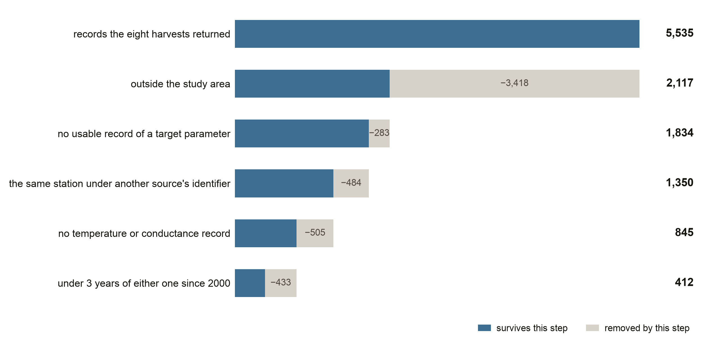

Each bar is the bar above it, split into what survived the step named on the
left and what the step removed, so a reader can subtract two bars and get the
gray between them. 412 stations remain: 207 measure both parameters, 65 measure
both with a continuous monitor, and 96 of the 412 gage discharge. The chain
tests two things, existence and length: whether a station measures a state
variable of the model, and whether it measures one for at least 3 years between
2000 and today. The last step tests the longer of the temperature and
conductance records rather than their overlap, because a modeler can calibrate
the temperature field against a thermograph alone, with no conductance record.
Record type, discharge, channel class, currency, and the overlap between the
two records are columns on `catalog_filtered.csv` rather than steps here. A
monthly conductance sample still constrains a seasonal signal and, against a
gaged flow, a salt load. A canal or a well is a boundary term a salt balance
needs. A record that ended in 2014 covers fourteen years of the period. A
station removed here stays in the inventory. Figure 10 maps what's left.

## Figure 10. Stations with 3 years or more of water temperature or specific conductance since 2000

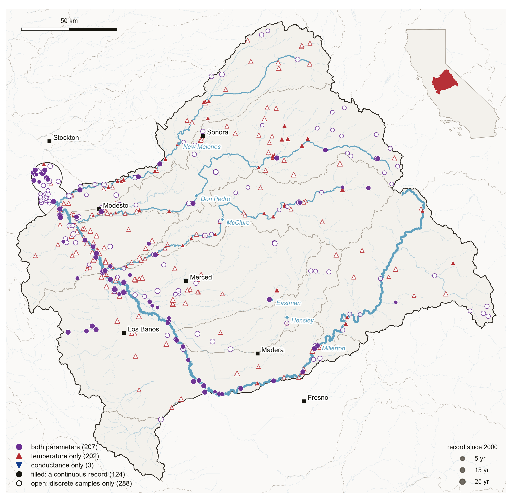

The 412 stations in figure 9's last bar, listed in
`data/processed/catalog_filtered.csv` and ranked there in the order figure 8
numbers them. A station reaches this map on one parameter or on two: 179 hold 3
years or more of both since 2000, and 233 of only one. Marker shape follows the
parameters a station has measured in any year: 207 measured both, 202
temperature alone, and 3 conductance alone. Marker area is the longer of the
two records clipped to 2000 onward, which is the quantity the rule tests, so a
marker at the smallest size stands for a record of close to 3 years. A filled
marker means one of the two records comes from a continuous monitor, which is
true at 124 of the 412 stations. Record type, discharge, channel class, and
currency stay columns on the CSV rather than filters, so 105 stations here sit
off the modeled channel, and 96 of the 412 gage discharge.

## Figure 11. Continuous records in each year

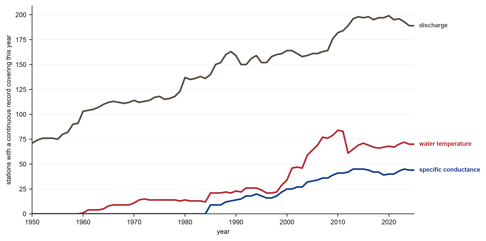

How many stations held a continuous record covering each year from 1950 to
2025, by parameter. A station counts in every year its period of record spans,
so the line is the standing network rather than the stations that started that
year. Discrete samples are out: a temperature calibration uses a continuous
record, and counting monthly samples would flatten the shape. Groundwater wells
and dataset-scope records are out too, on the same rule figure 6 uses, so the
number of solid bars reaching into a year on a figure 6 panel is the value this
curve plots for that year.

## Figure 12. Temperature and flow measured together

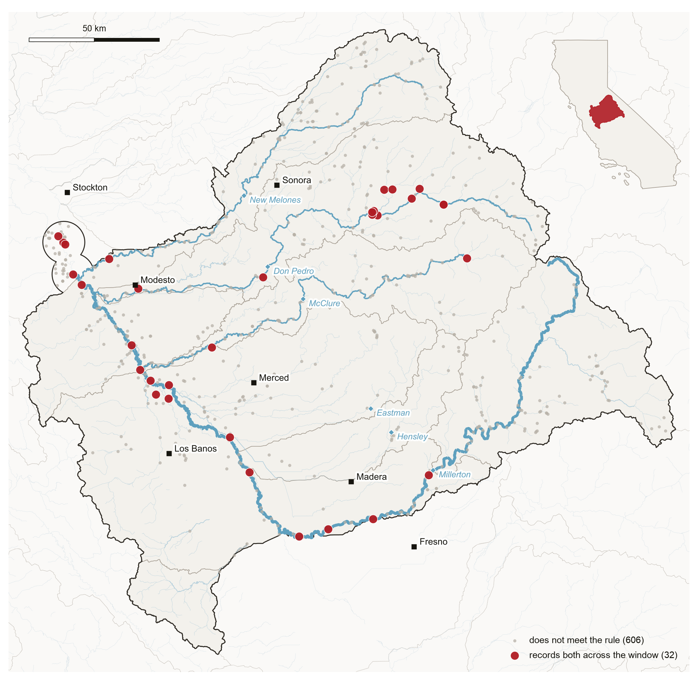

32 stations over 2011-2025. The 606 stations that measure at least one of these
parameters in the window and don't meet the rule are gray. 56 of the gray
stations measure every parameter in the rule and fail on continuity or on the
span instead. Rule: both parameters from a continuous monitor from the first
day of the window to the last, with no break longer than 180 days. Extending
the window 10 years further back leaves 14 stations. Figure 13 adds conductance
to the same rule. Figure 15 shows how the counts on figures 12 and 13 change
with the length of the window.

## Figure 13. Temperature, conductance and flow measured together

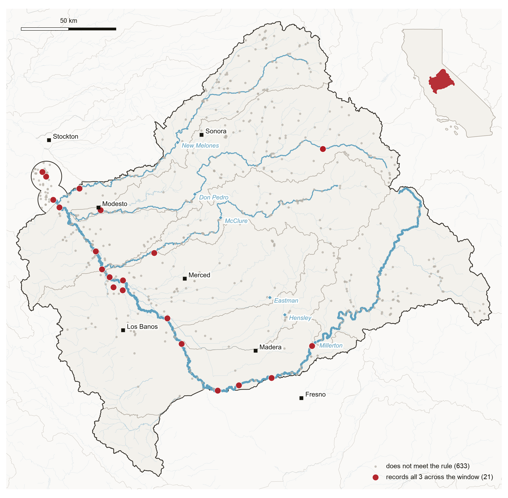

21 stations over 2011-2025. The 633 stations that measure at least one of these
parameters in the window and don't meet the rule are gray. 47 of the gray
stations measure every parameter in the rule and fail on continuity or on the
span instead. Figure 12's rule with conductance added. Conductance is the
scarce measurement: 32 stations meet the rule for temperature and flow, 21 of
those 32 also meet the rule for conductance, and adding conductance drops 11
stations. A modeler can calibrate a temperature and salinity model directly
against those 21. Figure 15 shows how the counts on figures 12 and 13 change
with the length of the window.

## Figure 14. Where a salt load can be computed

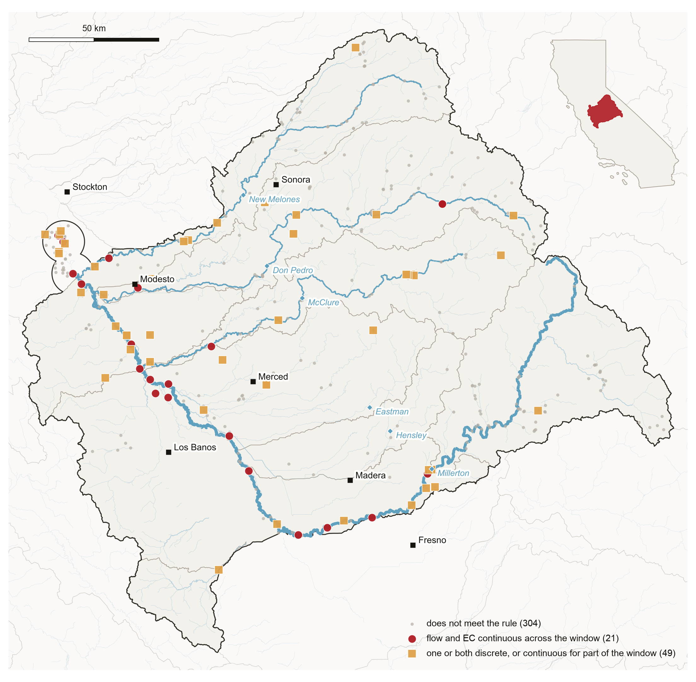

70 stations over 2011-2025. The 304 stations that measure at least one of these
parameters in the window and don't meet the rule are gray. Rule: flow and
conductance both measured inside the window, at whatever frequency each source
reports, with no requirement that either spans the window. A gaged flow and a
monthly conductance sample produce a monthly salt load, which is what a salt
balance needs from a tributary mouth or a permitted outfall. A circle marks a
station with both records from a continuous monitor across the whole window. Of
the 49 squares, 17 mark stations with both records from a continuous monitor
and one or both covering part of the window, and at the other 32 one or both
parameters come only from discrete samples inside the window. 21 of the 49
squares mark stations on a natural channel. Figure 15 shows how the counts on
figures 12 and 13 change with the length of the window.

## Figure 15. Choosing the coverage window

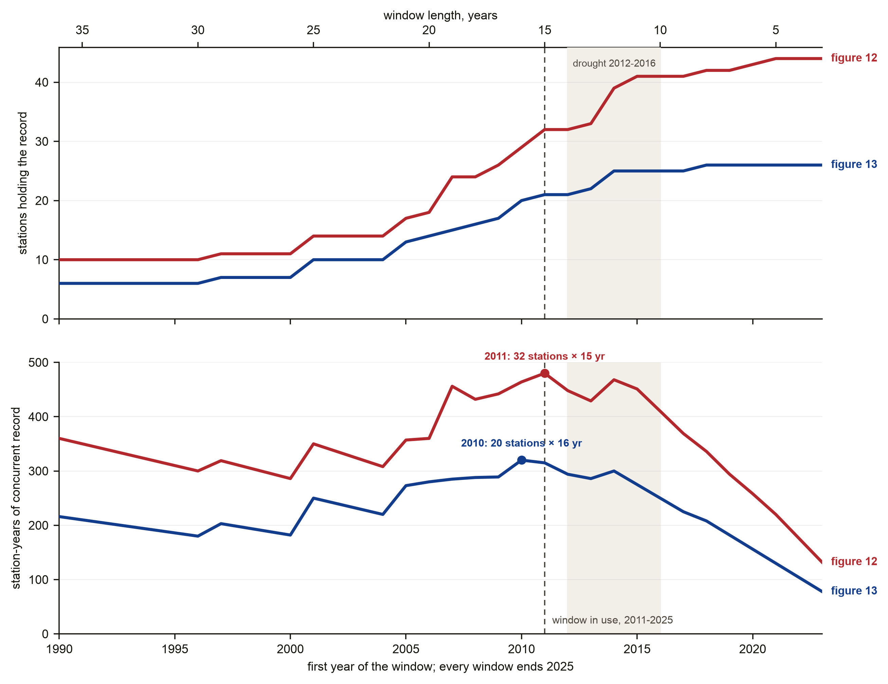

Every point is one window, starting in the year on the axis and ending 2025.
The count is the stations with a continuous record across the whole window and
no break longer than 180 days. The top panel is the tradeoff. Reaching back to
1990 leaves 10 stations measuring temperature and discharge together; starting
in 2023 leaves 44. A short window keeps more stations and a long one keeps more
years, so neither end of the top panel settles the window. The lower panel
plots stations times window length, which is the concurrent record a window
makes available, and that product peaks at 2011 for temperature and discharge
and 2010 for the three parameters together. The window in use, 2011-2025, sits
at the first peak and within 2 percent of the second peak. The shaded band is
the 2012-2016 drought: a window starting after 2012 covers part of the drought,
and one starting after 2016 covers none of it.
